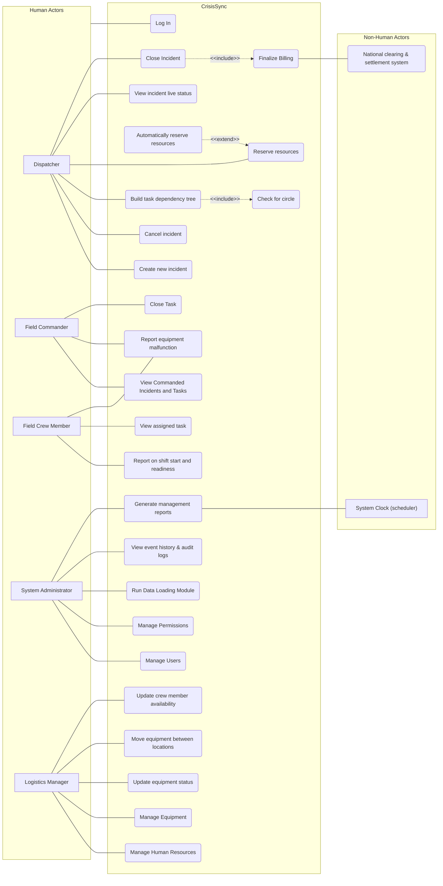

```mermaid
flowchart LR

%% Human Actors
    subgraph HumanActors ["Human Actors"]
        Dispatcher["Dispatcher"]
        FieldCommander["Field Commander"]
        Crew["Field Crew Member"]
        SysAdmin["System Administrator"]
        LogisticsManager["Logistics Manager"]
    end

    subgraph NonHumanActors ["Non-Human Actors"]
        Clearing("National clearing & settlement system")
        SysClock["System Clock (scheduler)"]
    end

%% CrisisSync System Boundary
subgraph CrisisSync ["CrisisSync"]
UC01("Log In")
UC02("Manage Users")
UC03("Manage Permissions")
UC04("Run Data Loading Module")
UC05("View event history & audit logs")
UC06("Generate management reports")
UC07("Manage Human Resources")
UC08("Manage Equipment")
UC09("Update equipment status")
UC10("Move equipment between locations")
UC11("Update crew member availability")
UC12("Create new incident")
UC13("Cancel incident")
UC14("Build task dependency tree")
UC14_1("Check for circle")

%% ResGroup forces UC15 to the left and UC15_1 immediately to its right
subgraph ResGroup [" "]
direction RL
UC15_1("Automatically reserve resources") -.->|&lt;&lt;extend&gt;&gt;| UC15("Reserve resources")
end
style ResGroup fill:none,stroke:none

UC16("View incident live status")
UC17("Close Incident")
UC17_1("Finalize Billing")
UC18("View Commanded Incidents and Tasks")
UC23("Close Task")
UC20("Report on shift start and readiness")
UC21("View assigned task")
UC22("Report equipment malfunction")
end

%% Common Connections
HumanActors --- UC01

%% System Administrator Connections
SysAdmin --- UC02
SysAdmin --- UC03
SysAdmin --- UC04
SysAdmin --- UC05
SysAdmin --- UC06

%% Logistics Manager Connections
LogisticsManager --- UC07
LogisticsManager --- UC08
LogisticsManager --- UC09
LogisticsManager --- UC10
LogisticsManager --- UC11

%% Dispatcher Connections
Dispatcher --- UC12
Dispatcher --- UC13
Dispatcher --- UC14
Dispatcher --- UC15
Dispatcher --- UC16
Dispatcher --- UC17

%% Field Commander Connections (Fixed Authorizations)
FieldCommander --- UC18
FieldCommander --- UC22
FieldCommander --- UC23

%% Non-Human Actor Connections
UC17_1 --- Clearing
UC06 --- SysClock

%% Field Crew Member Connections (Fixed Authorizations)
Crew --- UC20
Crew --- UC21
Crew --- UC22

%% Includes and Extends
UC14 -.->|&lt;&lt;include&gt;&gt;| UC14_1
UC17 -.->|&lt;&lt;include&gt;&gt;| UC17_1

```